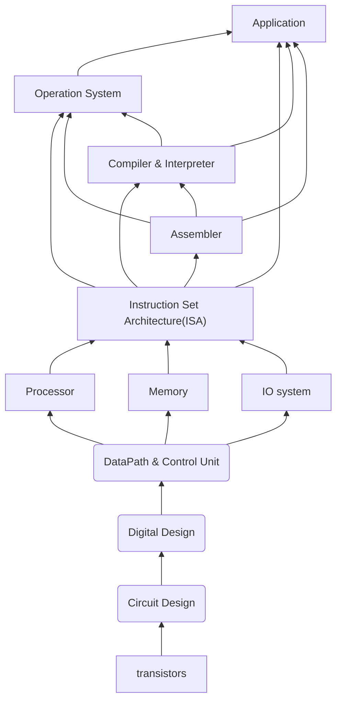
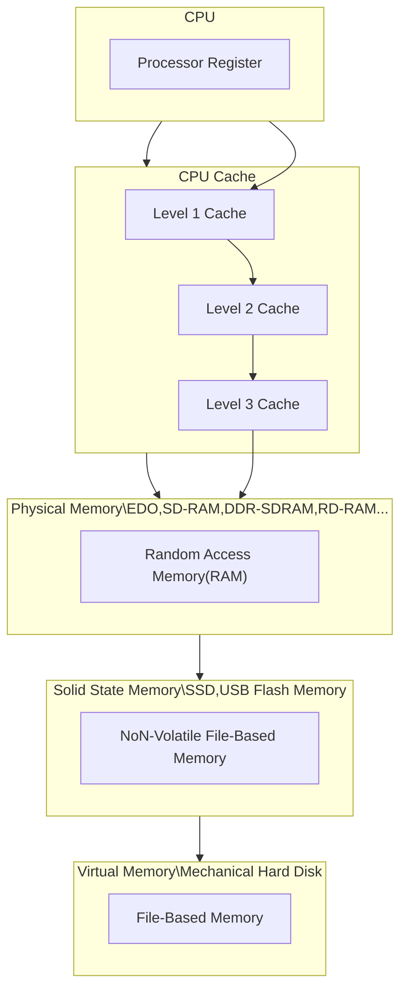

# Computer_composition

- Hardware and software interface
  - [C](C/README.md)
  - Assembly
- CPU
  - RISC-V
- schematics
  - Verilog or VHDl
  - logisim or Digital

## [C](C/README.md)

### 1.Intro,Pointers-Number Rep Review & Overview an

### 2.Arrays,Strings,More Pointers

### 3.C Memory

## [Labs](Labs/README.md)

Great Idea

### 1.Abstraction(Levels of Representation/Interpretation)

### 2.moore's law(摩尔定律)

### 3.Principle of Locality

#### Memory Hierarchy

### 4.Parallelism

### 5.Dependability via Redundancy
